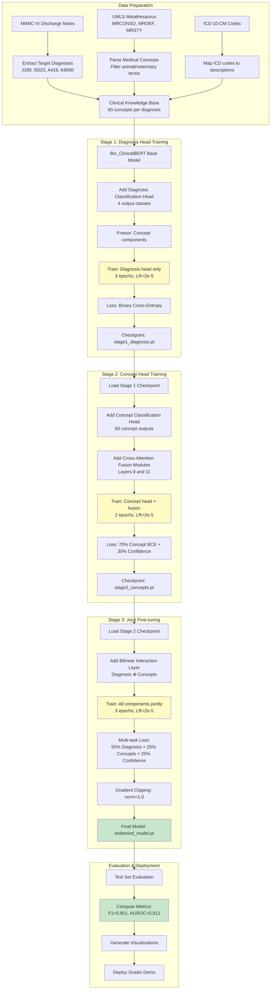
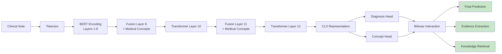

# ShifaMind Training Pipeline

## Complete 3-Stage Training Process

## Training Configuration

### Hyperparameters

| Parameter | Value |
|-----------|-------|
| Base Model | Bio_ClinicalBERT |
| Max Sequence Length | 384 tokens |
| Batch Size | 8 (training), 16 (eval) |
| Learning Rate | 2e-5 |
| Weight Decay | 0.01 |
| Warmup Ratio | 0.1 |
| Gradient Clipping | 1.0 |
| Random Seed | 42 |

### Stage-Specific Settings

| Stage | Epochs | Loss Function | Components Trained |
|-------|--------|---------------|-------------------|
| Stage 1 | 3 | BCE (diagnosis) | Diagnosis head only |
| Stage 2 | 2 | 70% Concept BCE + 30% Confidence | Concept head + fusion modules |
| Stage 3 | 3 | 50% Diagnosis + 25% Concepts + 25% Confidence | All components |

### Dataset Split

- **Training**: 70% (~2,100 samples per diagnosis)
- **Validation**: 15% (~450 samples per diagnosis)
- **Test**: 15% (~450 samples per diagnosis)

**Total**: ~3,000 samples per diagnosis × 4 diagnoses = 12,000 samples

### Compute Requirements

- **GPU**: NVIDIA T4 (16GB VRAM) or better
- **Training Time**: ~6 hours on T4, ~1 hour on A100
- **Storage**: ~2GB for checkpoints

## Inference Pipeline

---

**Render this file in any Markdown viewer that supports Mermaid diagrams**
